# Results

The benchmark_videos folder contains a set of videos of different types used to test how videos with different distribution of objects perform across models and analytics frameworks. The json files contain distribution of total number of objects and the object class on a frame level.

| Video name | Description | Duration (s) | FPS |
| --- | --- | --- | --- |
| video0 | Single frame of a car, repeated across the entire video | 40 | 25 |
| video1 | Composited video with normal distribution of car (μ=1, σ=0) | 40 | 25 |
| video2 | Composited video with normal distribution of car (μ=1, σ=1) | 40 | 25 |
| video3 | Composited video with normal distribution of car (μ=1, σ=0), person (μ=1, σ=1), motorbike (μ=1, σ=1) | 40 | 25 |

The result_res folder contains the raw detection data for each benchmarking run as a json so that data is available for future analysis.

## Benchmarks
When running the object detection, the first frame usually takes longer to execute as compared to the rest of the frames. So for each benchmark, the 2 graphs are plotted. The one on the left is with frame 1, and the one on the right without so that features can be seen more clearly.

### video0
#### Object Distribution:  
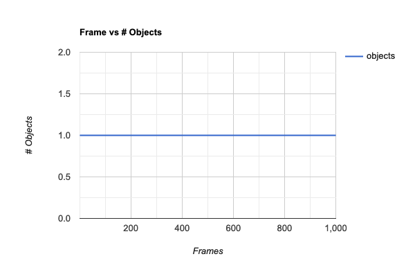

#### Argus maskrcnn: 
| With Frame 1 | Without Frame 1 |
| --- | --- | 
|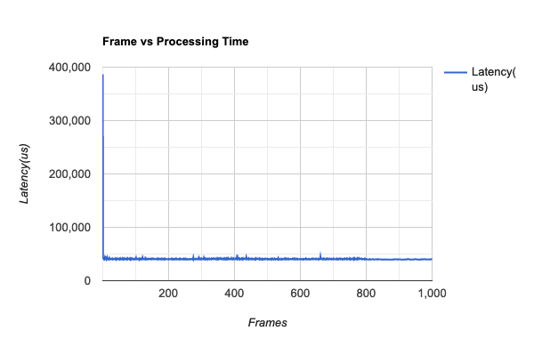 | 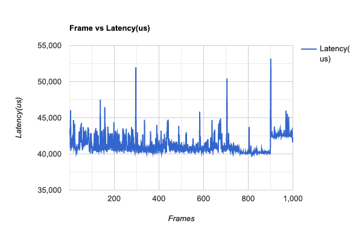 |

Total expected detections: 1000  
Total actual detections: 2981  
Total hits: 1000  
Total misses: 0  
Precision: 33.545790003354576  
Recall: 100.0

#### Rocket framednntf: 
| With Frame 1 | Without Frame 1 |
| --- | --- | 
|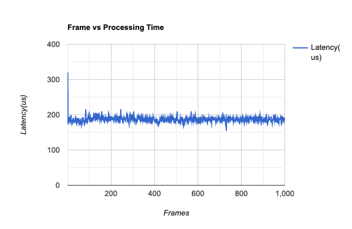 |  |

Total expected detections: 1000  
Total actual detections: 0  
Total hits: 0  
Total misses: 999  
Precision: 0  
Recall: 0.0

#### Rocket ONNX Yolo: 
| With Frame 1 | Without Frame 1 |
| --- | --- | 
|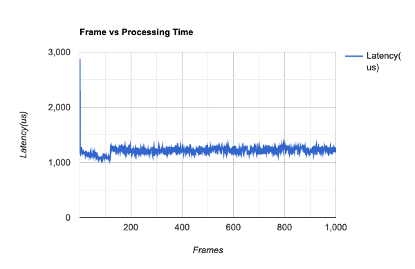 | 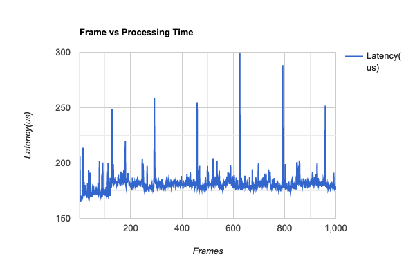 |

### video1
#### Object Distribution:  

#### Argus maskrcnn: 
| With Frame 1 | Without Frame 1 |
| --- | --- | 
| | 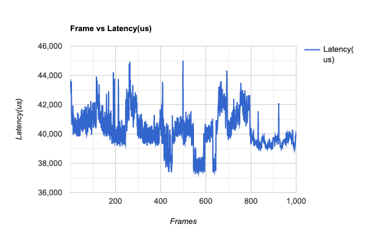 |

Total expected detections: 1000  
Total actual detections: 2081  
Total hits: 208  
Total misses: 792  
Precision: 9.995194617972128  
Recall: 20.8

#### Rocket framednntf: 
| With Frame 1 | Without Frame 1 |
| --- | --- | 
|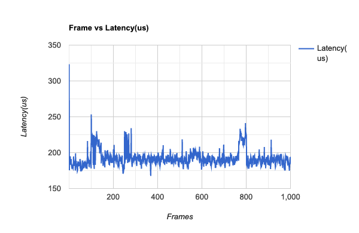 | 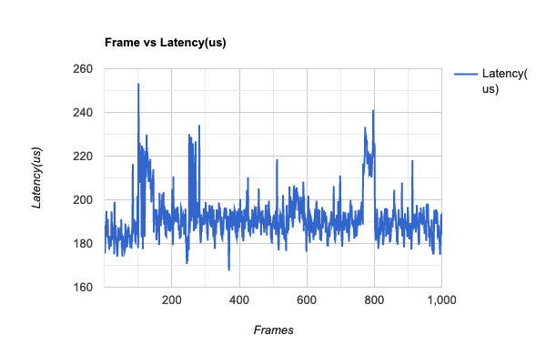 |

Total expected detections: 1000  
Total actual detections: 85  
Total hits: 64  
Total misses: 935  
Precision: 75.29411764705883  
Recall: 6.4

#### Rocket ONNX Yolo: 
| With Frame 1 | Without Frame 1 |
| --- | --- | 
|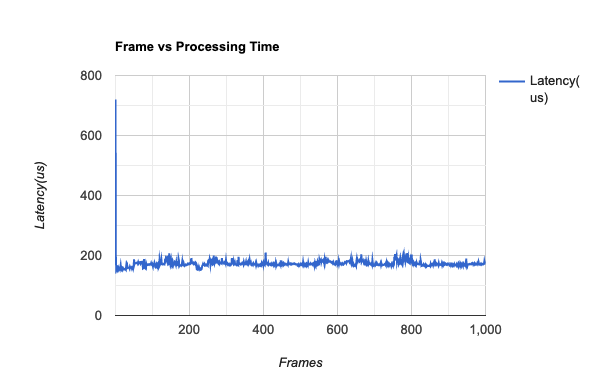 | 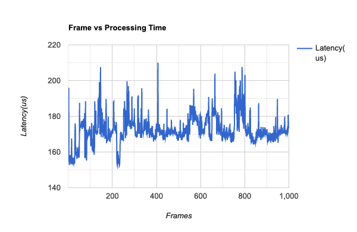 |

### video2
#### Object Distribution:  
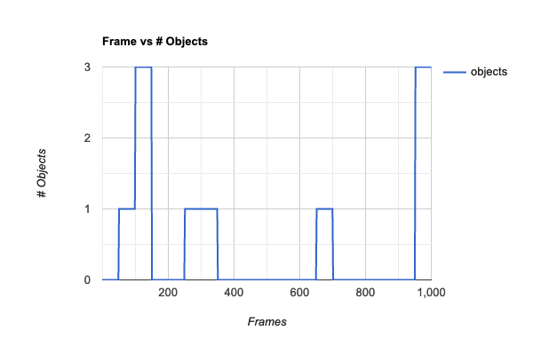

#### Argus maskrcnn: 
| With Frame 1 | Without Frame 1 |
| --- | --- | 
|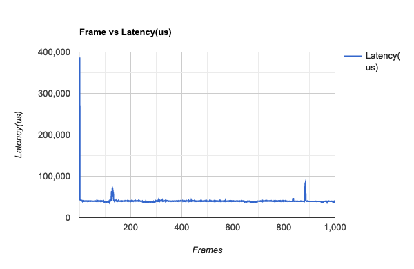 | 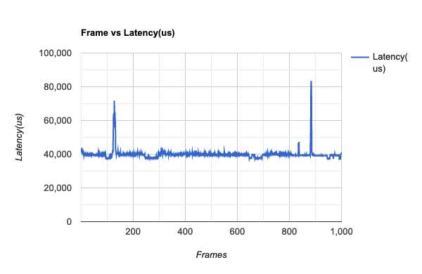 |

Total expected detections: 300  
Total actual detections: 1136  
Total hits: 68  
Total misses: 232  
Precision: 5.985915492957746  
Recall: 22.666666666666668

#### Rocket framednntf: 
| With Frame 1 | Without Frame 1 |
| --- | --- | 
|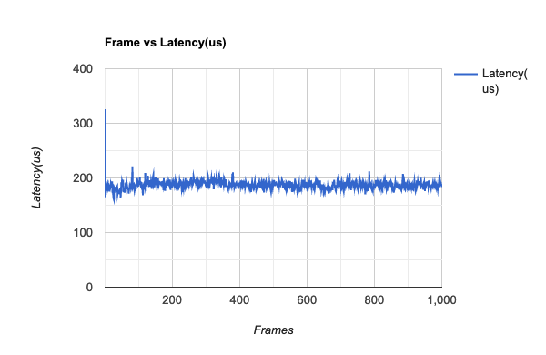 | 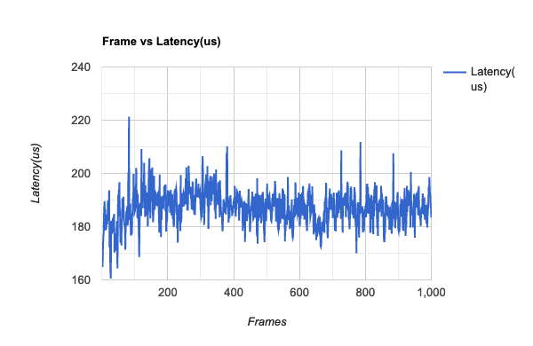 |

Total expected detections: 300  
Total actual detections: 0  
Total hits: 0  
Total misses: 299  
Precision: 0  
Recall: 0.0

#### Rocket ONNX Yolo: 
| With Frame 1 | Without Frame 1 |
| --- | --- | 
|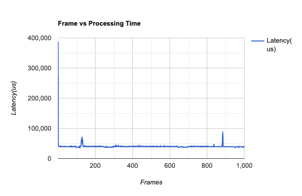 | 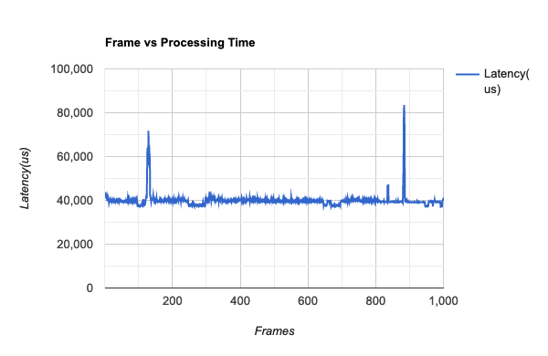 |

### video3
#### Object Distribution:  
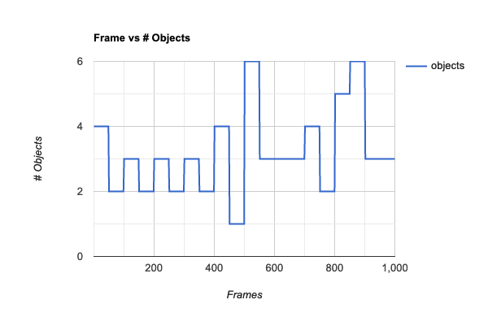

#### Argus maskrcnn: 
| With Frame 1 | Without Frame 1 |
| --- | --- | 
|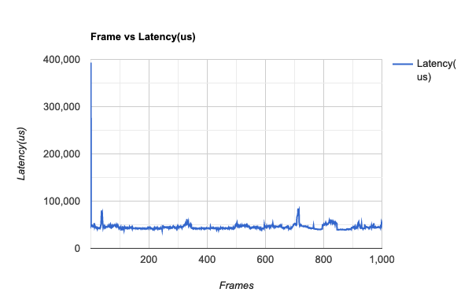 | 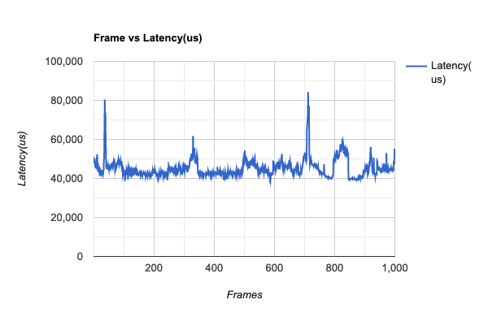 |

Total expected detections: 2450  
Total actual detections: 6450  
Total hits: 1207  
Total misses: 1243  
Precision: 18.713178294573645  
Recall: 49.265306122448976

#### Rocket framednntf: 
| With Frame 1 | Without Frame 1 |
| --- | --- | 
|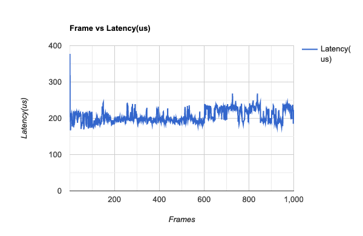 | 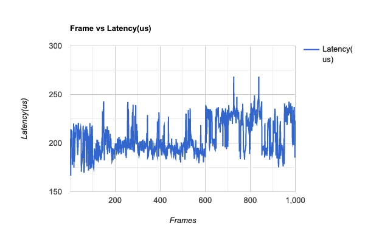 |

Total expected detections: 2450  
Total actual detections: 370  
Total hits: 275  
Total misses: 2173  
Precision: 74.32432432432432  
Recall: 11.224489795918368

#### Rocket ONNX Yolo: 
| With Frame 1 | Without Frame 1 |
| --- | --- | 
|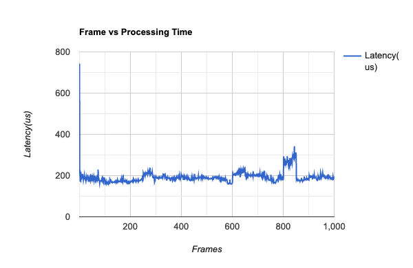 | 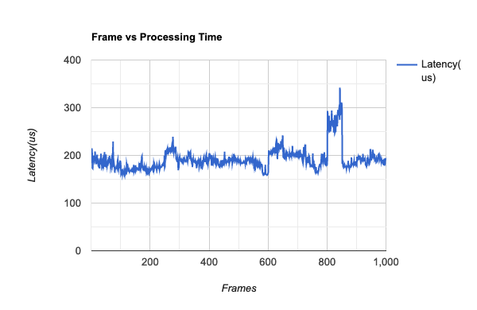 |
